# 1. Provisioning

## 1. Install gcloud CLI

1. Update packages
```bash
sudo apt update
```

2. Install packages pendukung
```bash
sudo apt -y install apt-transport-https ca-certificates gnupg curl sudo
```

3. Menambah distribution URI
```bash
echo "deb https://packages.cloud.google.com/apt cloud-sdk main" | sudo tee -a /etc/apt/sources.list.d/google-cloud-sdk.list
```

4. Import gcloud public key
```bash
curl https://packages.cloud.google.com/apt/doc/apt-key.gpg | sudo apt-key --keyring /usr/share/keyrings/cloud.google.gpg add -
```

5. Install gcloud CLI
```bash
sudo apt update && sudo apt install google-cloud-cli
```

## 2. Create VM Google Cloud using Terraform

1. Login google dan jadikan sebagai default
```bash
gcloud auth application-default login
```
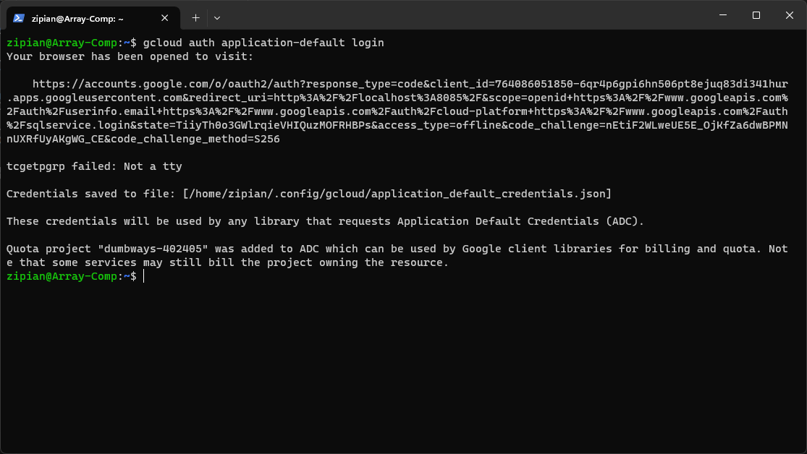

2. Buat file `main.tf` sebagai configurasi nya
```terraform
terraform {
  required_providers {
    google = {
      source = "hashicorp/google"
      version = "5.2.0"
    }
  }
}

provider "google" {
  project     = "dumbways-402405"
  region      = "us-west1" #Low CO2
}

resource "google_compute_instance" "appserver" {
  name         = "appserver"
  machine_type = "e2-standard-4" #4 vCPU (2 core), 16 GB memory
  zone         = "us-west1-a"
  
  boot_disk {
    initialize_params {
      image = "ubuntu-os-cloud/ubuntu-2004-lts"
    }
  }
  
  network_interface {
    network = "default"
    network_ip = "10.138.0.2" #subnet 10.138.0.0/20
    access_config {
      nat_ip = google_compute_address.public_appserver.address
    }
  }

  metadata = {
    ssh-keys = "alfiansy:${file("/mnt/c/Users/zVersion/.ssh/gcp.pub")}"
  }
}

resource "google_compute_instance" "gateway" {
  name         = "gateway"
  machine_type = "e2-standard-2" #2 vCPU (1 core), 8 GB memory
  zone         = "us-west1-a"
  
  boot_disk {
    initialize_params {
      image = "ubuntu-os-cloud/ubuntu-2004-lts"
    }
  }
  
  network_interface {
    network = "default"
    network_ip = "10.138.0.3" #subnet 10.138.0.0/20
    access_config {
      nat_ip = google_compute_address.public_gateway.address
    }
  }

  metadata = {
    ssh-keys = "alfiansy:${file("/mnt/c/Users/zVersion/.ssh/gcp.pub")}"
  }
}

resource "google_compute_address" "public_appserver" {
  name = "public-appserver"
}

resource "google_compute_address" "public_gateway" {
  name = "public-gateway"
}

resource "google_compute_firewall" "allow_all" {
  name    = "allow-all"
  network = "default"

  allow {
    protocol = "all"
  }

  source_ranges = ["0.0.0.0/0"]
}

output "appserver_private_ip" {
  value = google_compute_instance.appserver.network_interface.0.network_ip
}

output "gateway_private_ip" {
  value = google_compute_instance.gateway.network_interface.0.network_ip
}

output "appserver_public_ip" {
  value = google_compute_address.public_appserver.address
}

output "gateway_public_ip" {
  value = google_compute_address.public_gateway.address
}
```

3. Inisialisasi config terraformnya
```bash
terraform init
```
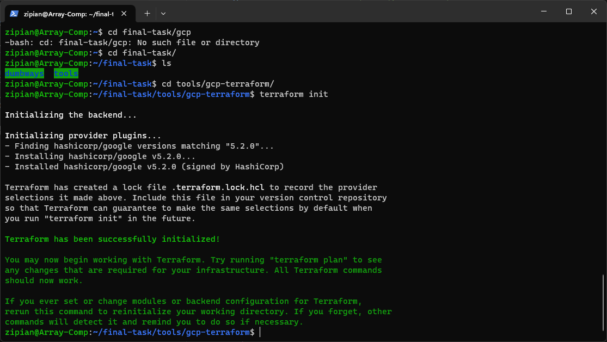

4. Lalu aplikasikan config nya guna membuat vm di gcp, lalu konfirmasi dengan `yes`
```bash
terraform apply
```
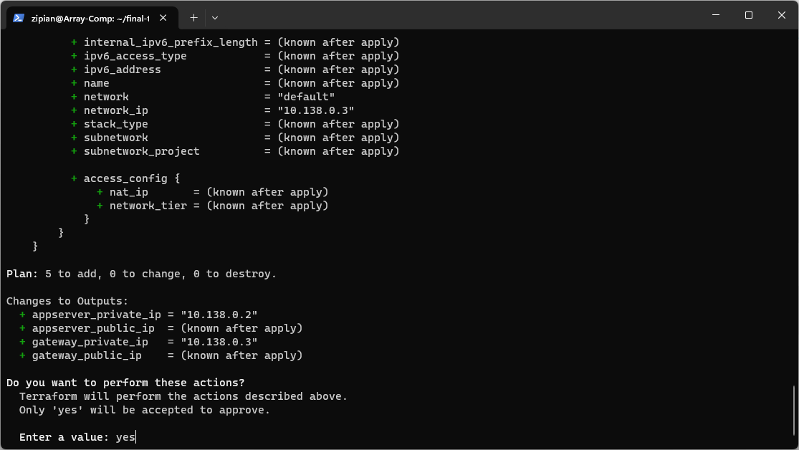

5. Setelah berhasil maka akan tampil output berupa ip vm sesusai dengan config yang kita buat diatas
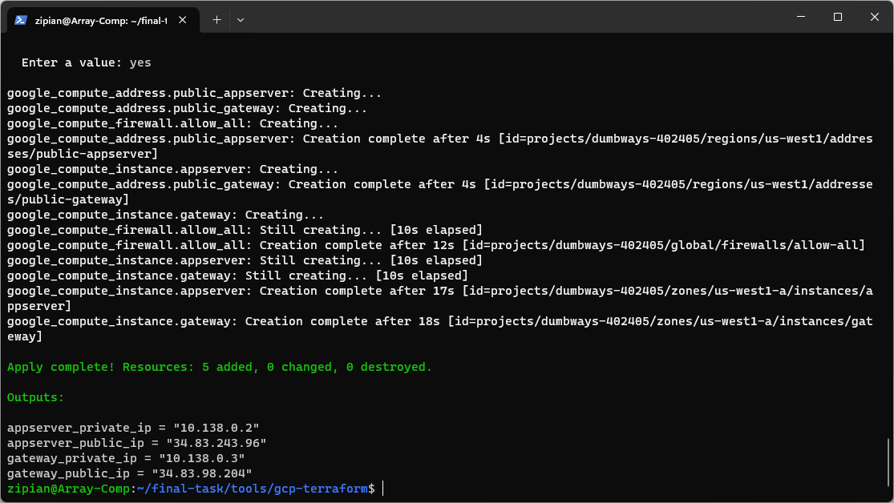

6. Lakukan pengecekan juga pada google cloud console nya via browser
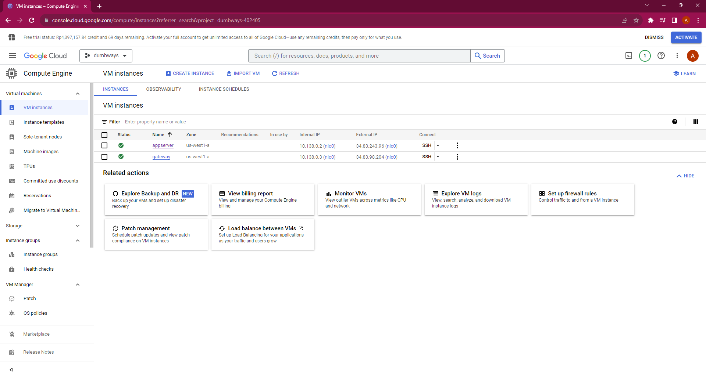

## 3. Configure VM using Ansible

1. Buat file `ansible.cfg`
```ansible
[defaults]

# target to the inventory file
inventory = Inventory

# used for ansible to access the server with ssh-key
private_key_file = /home/zipian/.ssh/id_rsa

# skipping known_hosts checking
host_key_checking = False

# python intrepreter
interpreter_python = auto_silent
```

2. Buat file `Inventory`
```ansible
[appserver]
34.83.243.96

[gateway]
34.83.98.204

[all:vars]
ansible_connection=ssh
ansible_user=alfiansy
```

3. Lakukan ping apakah ke 2 server tersebut sudah berhasil connect atau belum
```bash
ansible all -m ping
```
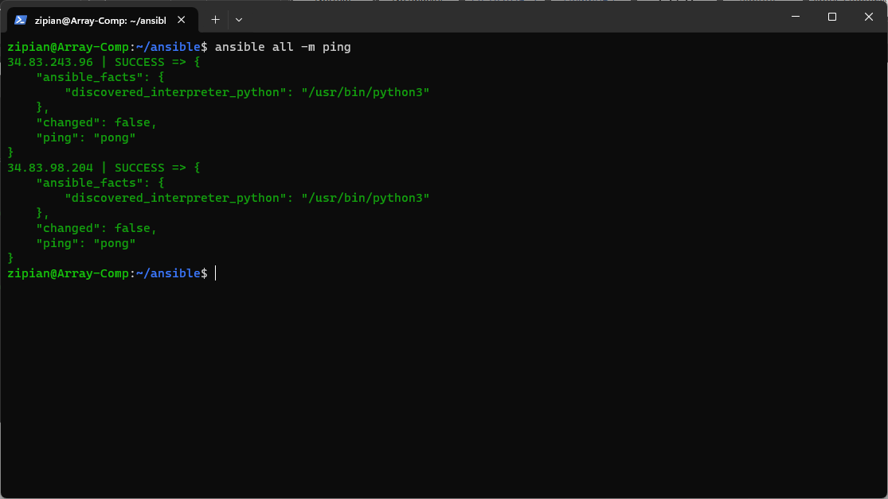

4. Buat file `docker.yml` dan jalankan menggunakan ansible playbook
```ansible
- become: true
  gather_facts: false
  hosts: all
  tasks:
   - name: "Install docker - Prerequisites"
     apt:
       update_cache: true
       name:
         - apt-transport-https
         - software-properties-common
         - ca-certificates
         - curl
         - gnupg
         - lsb-release
         - python3-pip
   - name: "Install docker - GPG key"
     apt_key:
       url: "https://download.docker.com/linux/ubuntu/gpg"
   - name: "Install docker - Add repository"
     apt_repository:
       repo: "deb https://download.docker.com/linux/ubuntu focal stable"
       state: present
   - name: "Install docker - Engine"
     apt:
       update_cache: true
       name:
         - docker-ce
         - docker-ce-cli
         - containerd.io
         - docker-buildx-plugin
         - docker-compose-plugin
   - name: "Install docker - SDK for Python"
     pip:
       name:
         - docker
         - docker-compose
   - name: "Add user to docker group"
     user:
       name: "{{username}}"
       groups: docker
       append: true

  vars:
   - username: "alfiansy"
```
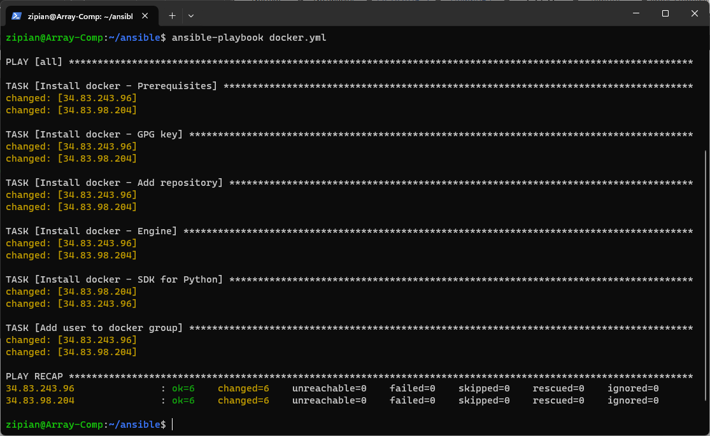

5. Buat file `node-exporter.yml` dan jalankan menggunakan ansible playbook
```ansible
- become: true
  gather_facts: false
  hosts: all
  tasks:
   - name: "Pull Node-Exporter image"
     docker_image:
       name: bitnami/node-exporter
       tag: latest
       source: pull
   - name: "Run Node-Exporter container"
     docker_container:
       name: node-exporter
       image: bitnami/node-exporter:latest
       ports:
         - 9100:9100
       state: started
```
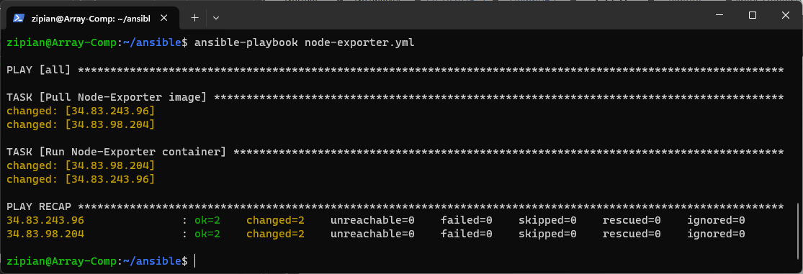

6. Buat file `dumbmerch.yml` dan jalankan menggunakan ansible playbook
```ansible
- become: true
  become_user: "{{username}}"
  gather_facts: false
  hosts: appserver
  tasks:
   - name: "Copy private key"
     copy:
       src: "/home/zipian/.ssh/id_rsa"
       dest: "/home/{{username}}/.ssh/id_rsa"
       mode: "0700"
   - name: "Git pull fe-dumbmerch"
     git:
       repo: "git@gitlab.com:zversion/fe-dumbmerch.git"
       dest: "/home/{{username}}/fe-dumbmerch"
   - name: "Git pull be-dumbmerch"
     git:
       repo: "git@gitlab.com:zversion/be-dumbmerch.git"
       dest: "/home/{{username}}/be-dumbmerch"

  vars:
   - username: "alfiansy"
  environment:
    GIT_SSH_COMMAND: "/usr/bin/ssh -o StrictHostKeyChecking=no"
```
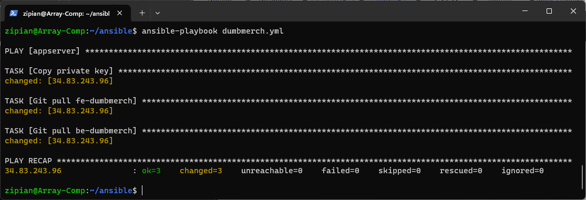

7. Buat file `prometheus.yml` dan jalankan menggunakan ansible playbook
```ansible
- become: true
  become_user: "{{username}}"
  gather_facts: false
  hosts: appserver
  tasks:
   - name: "Make directory prometheus"
     file:
       path: /home/{{username}}/prometheus
       state: directory
   - name: "Config Prometheus"
     copy:
       content: |
         global:

         scrape_configs:
          - job_name: 'dumbmerch'
            scrape_interval: 5s
            static_configs:
              - targets: [
                  "10.138.0.2:9100", 
                  "10.138.0.3:9100",
                  ]
       dest: /home/{{username}}/prometheus/prometheus.yml
   - name: "Pull Prometheus image"
     docker_image:
       name: bitnami/prometheus
       tag: latest
       source: pull
   - name: "Run Prometheus container"
     docker_container:
       name: prometheus
       image: bitnami/prometheus:latest
       ports:
         - 9090:9090
       volumes:
         - /home/{{username}}/prometheus/prometheus.yml:/opt/bitnami/prometheus/conf/prometheus.yml
       state: started

  vars:
   - username: "alfiansy"
```
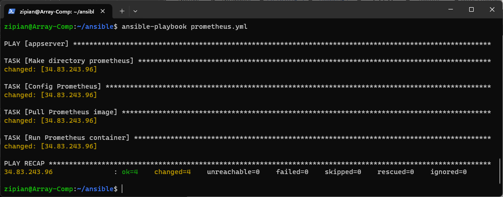

8. Buat file `grafana.yml` dan jalankan menggunakan ansible playbook
```ansible
- become: true
  gather_facts: false
  hosts: appserver
  tasks:
   - name: "Make directory grafana"
     ansible.builtin.file:
       path: /home/{{username}}/grafana
       state: directory
       mode: "0775"
   - name: "Pull Grafana image"
     docker_image:
       name: grafana/grafana
       tag: latest
       source: pull
   - name: "Run Grafana container"
     docker_container:
       name: grafana
       image: grafana/grafana:latest
       ports:
         - 3001:3000
       volumes:
         - /home/{{username}}/grafana:/var/lib/grafana
       state: started

  vars:
   - username: "alfiansy"
```
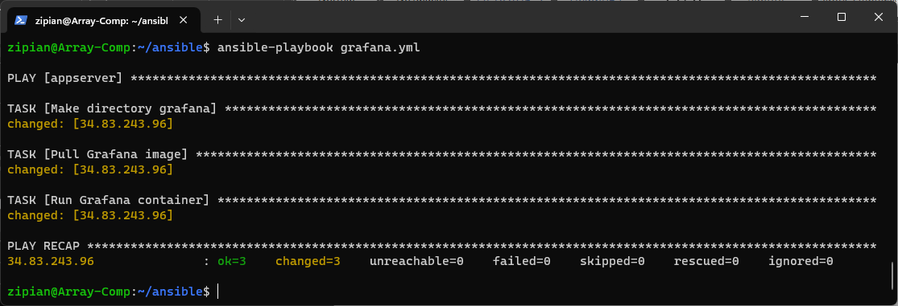

9. Buat file `nginx.yml` dan jalankan menggunakan ansible playbook
```ansible
- become: true
  gather_facts: false
  hosts: gateway
  tasks:
   - name: "Make directory nginx/ssl"
     file:
       path: /home/{{username}}/nginx/ssl
       state: directory
   - name: "Config nginx"
     copy:
       content: |
         server {
          server_name al.studentdumbways.my.id;

          location / {
           proxy_pass http://10.138.0.2:3000;
          }
          listen 443 ssl;
          ssl_certificate /etc/letsencrypt/live/al.studentdumbways.my.id/fullchain.pem; 
          ssl_certificate_key /etc/letsencrypt/live/al.studentdumbways.my.id/privkey.pem;
         }
         server {
          server_name api.al.studentdumbways.my.id;

          location / {
           proxy_pass http://10.138.0.2:5000;
          }
          listen 443 ssl;
          ssl_certificate /etc/letsencrypt/live/al.studentdumbways.my.id/fullchain.pem; 
          ssl_certificate_key /etc/letsencrypt/live/al.studentdumbways.my.id/privkey.pem;
         }
       dest: /home/{{username}}/nginx/dumbmerch.conf
   - name: "Pull Nginx image"
     docker_image:
       name: nginx
       tag: latest
       source: pull
   - name: "Run Nginx container"
     docker_container:
       name: nginx
       image: nginx:latest
       ports:
         - 80:80
         - 443:443
       volumes:
         - /home/{{username}}/nginx/dumbmerch.conf:/etc/nginx/sites-enabled/dumbmerch.conf
         - /home/{{username}}/nginx/ssl:/etc/letsencrypt/live/al.studentdumbways.my.id
       state: started

  vars:
   - username: "alfiansy"
```
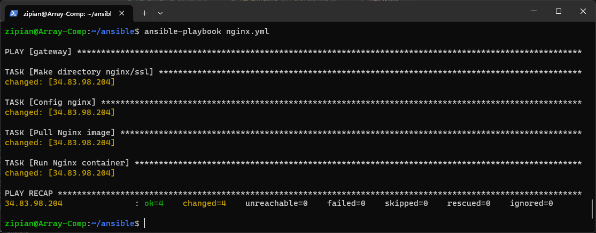

10. Lakukan pengecekan menggunakan browser
```bash
https://al.studentdumbways.my.id
```
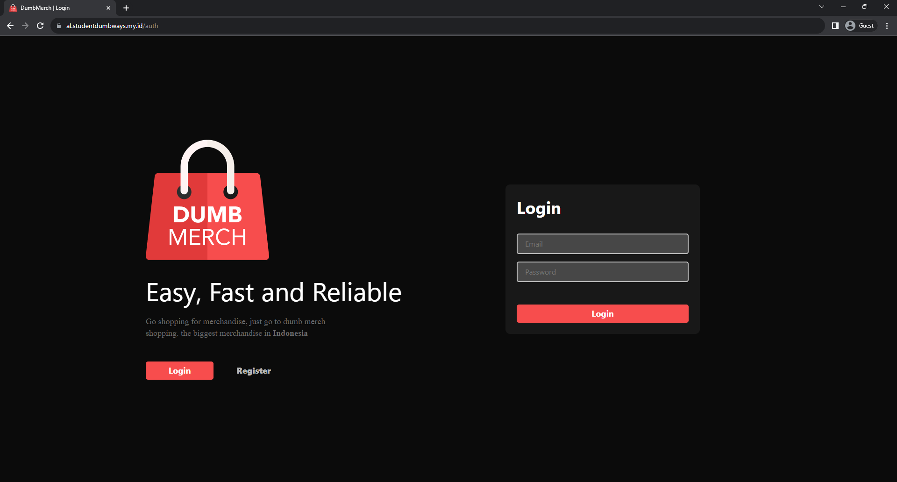


[**Back**](../README.md)