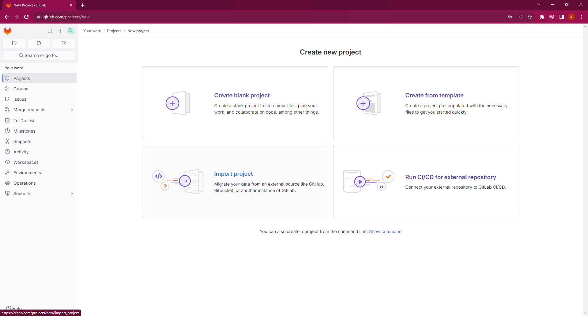
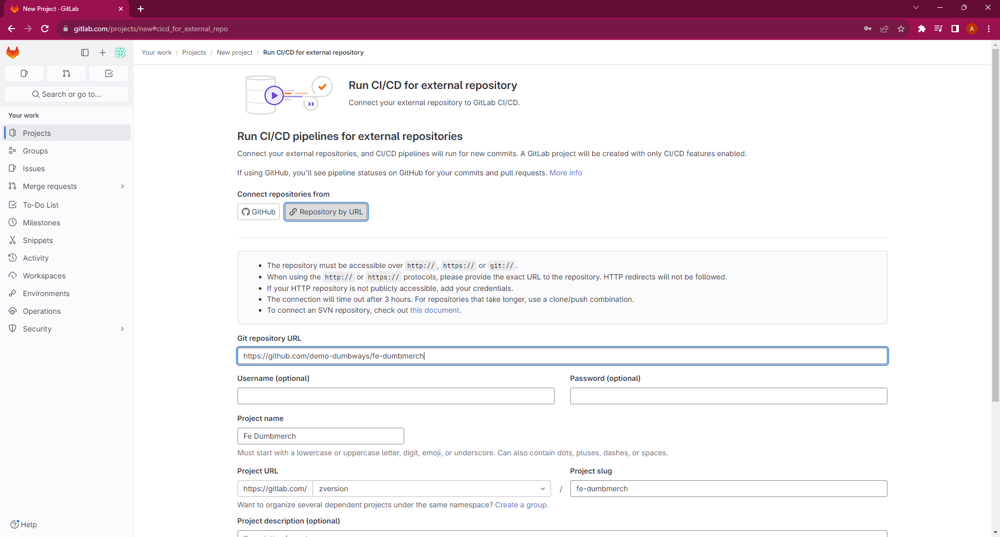
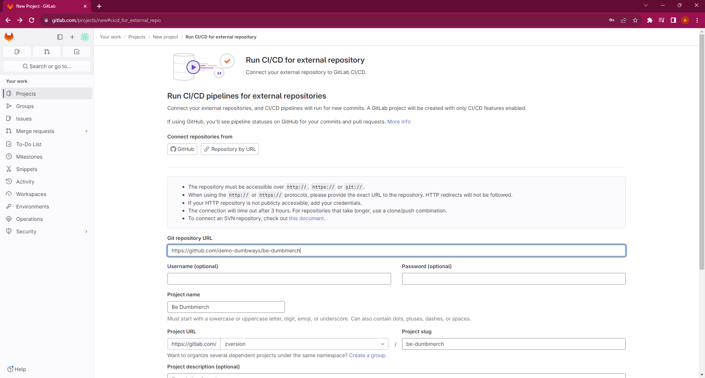
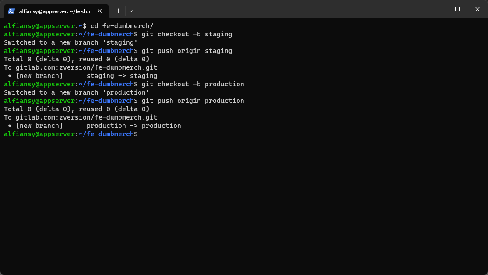
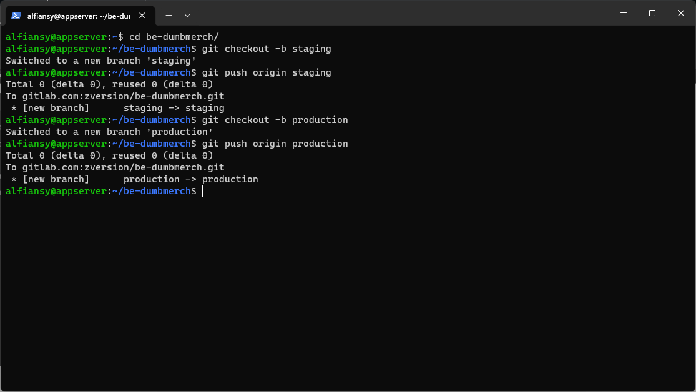

# 2. Repository

## 1. Create a repository

1. Buka halaman `New project`
```bash
https://gitlab.com/projects/new
```


2. Kemudian pilih `Run CI/CD for external repository`
- Connect repositories from: Repository by URL
- Git repository URL: https://github.com/demo-dumbways/fe-dumbmerch
- Visibility Level: Private


3. Lalu buat juga untuk Backend nya
- Connect repositories from: Repository by URL
- Git repository URL: https://github.com/demo-dumbways/be-dumbmerch
- Visibility Level: Private


## 2. Set up branches

1. Masuk ke direktori fe dan buat branch 
```bash
cd ~/fe-dumbmerch/
git checkout -b staging
git push origin staging
git checkout -b production
git push origin production
```


2. Lakukan hal yang pada be

```bash
cd ~/be-dumbmerch/
git checkout -b staging
git push origin staging
git checkout -b production
git push origin production
```


[**Back**](../README.md)