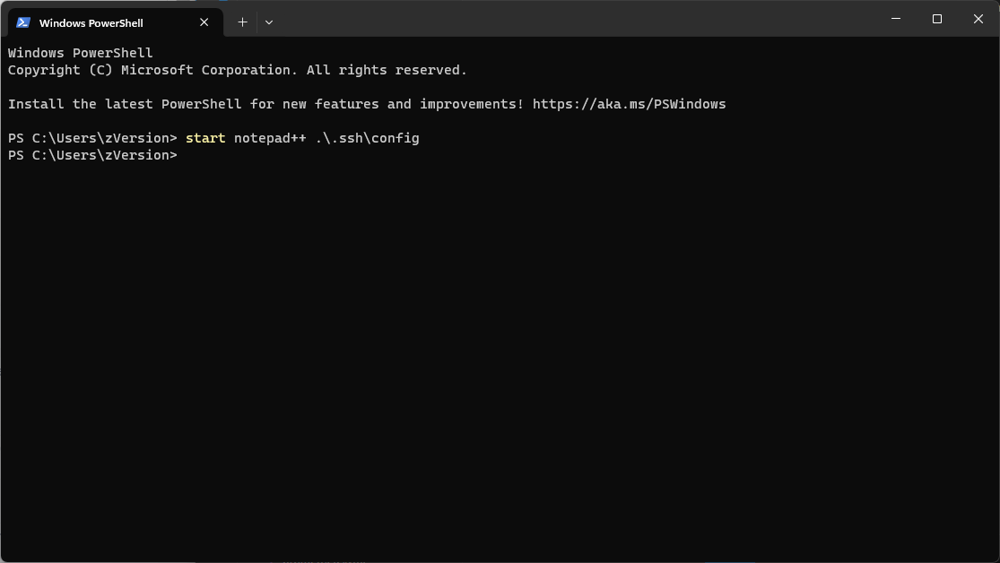
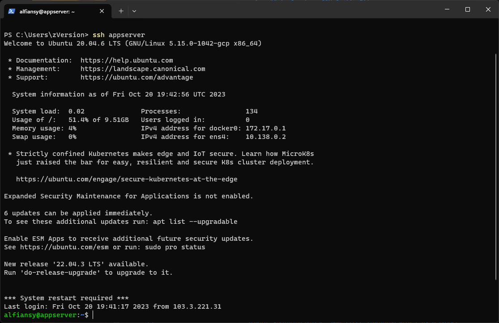
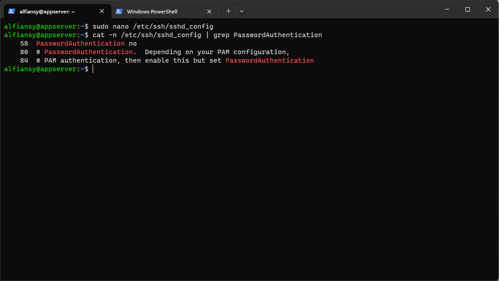
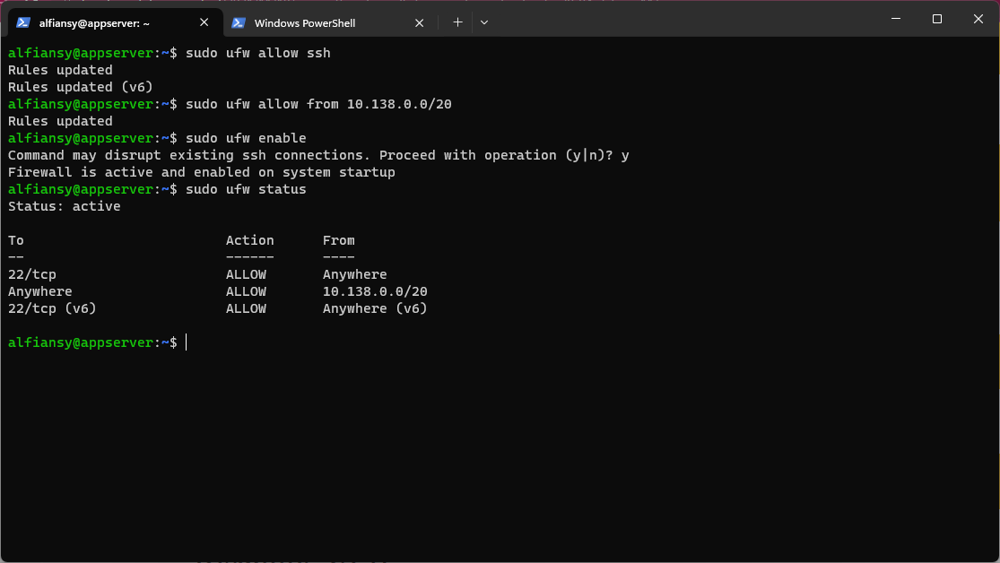
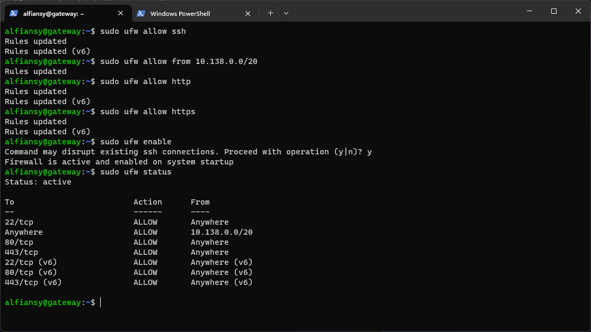

# 3. Server Management

## 1. Create a SSH Config Files

1. Buat file `config` pada direktori `.ssh` dengan notepad++
```bash
start notepad++ .\.ssh\config
```


2. Kemudian set ip, user dan private key
```bash
Host appserver
    HostName 34.83.243.96
    User alfiansy
	IdentityFile C:\Users\zVersion\.ssh\gcp

Host gateway
    HostName 34.83.98.204
    User alfiansy
    IdentityFile C:\Users\zVersion\.ssh\gcp
```

3. Lalu coba login menggunakan config yang sudah dibuat
```bash
ssh appserver
```


## 2. Password login disabled

1. Modifikasi file `sshd_config`
```bash
sudo nano /etc/ssh/sshd_config
```

2.  Ganti *PasswordAuthentication* `yes` menjadi `no` pada file `sshd_config`


3. Lalu restart service ssh
```bash
sudo systemctl restart ssh
```

## 3. Uncomplicated Firewall (UFW) 

1. Buat rules UFW pada appserver
```bash
sudo ufw allow ssh
sudo ufw allow from 10.138.0.0/20
sudo ufw enable
sudo ufw status
```


2. Buat rules UFW pada gateway
```bash
sudo ufw allow ssh
sudo ufw allow from 10.138.0.0/20
sudo ufw allow http
sudo ufw allow https
sudo ufw enable
sudo ufw status
```


[**Back**](../README.md)