# 4. Deployment

## 1. Setup PostgreSQL database on Railway

1. Login railway lalu klik `New Project` dan pilih `PostgreSQL`
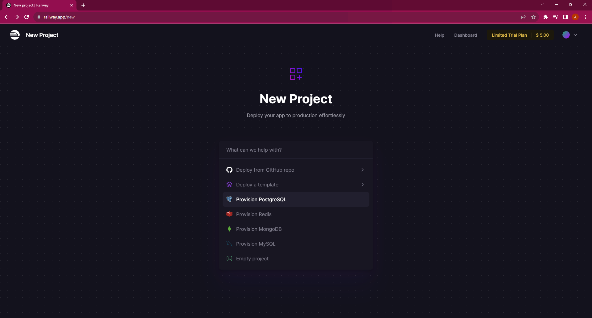

2. Kemudian ke tab `Connect` untuk mendapatkan credential dari database nya
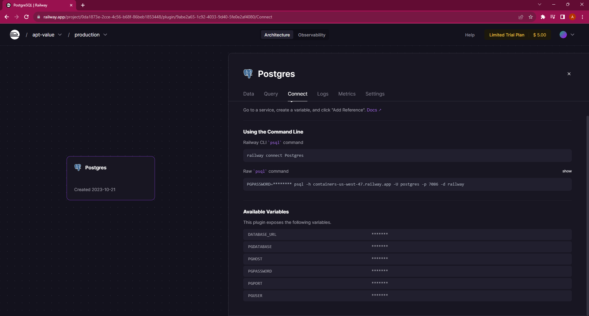

3. Lalu lakukan percobaan login pada wsl
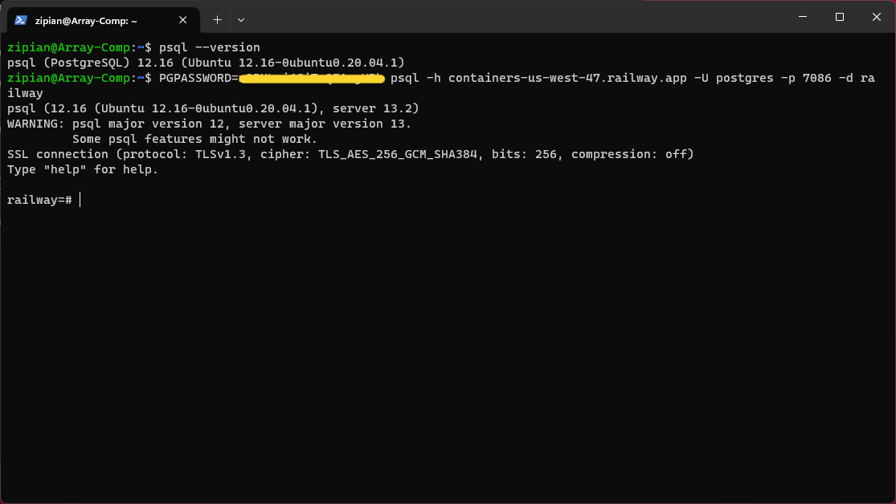

## 2. Create a Docker image for frontend
### 2.1. Staging

1. Masuk ke direktori fe dan branch staging
```bash
cd ~/fe-dumbmerch/
git checkout staging
```
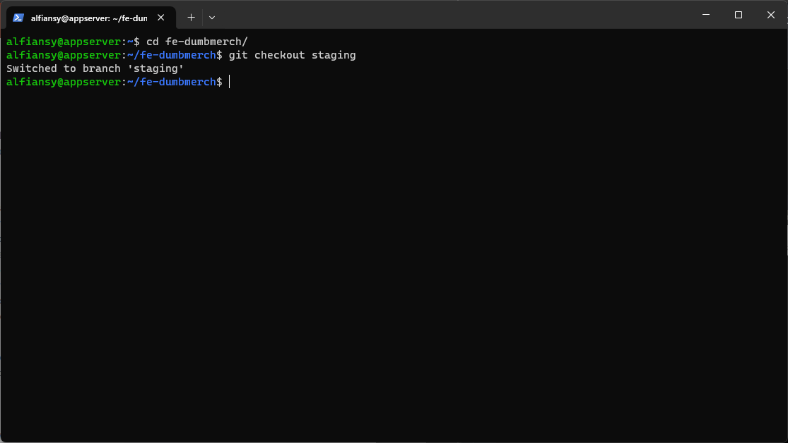

2. Membuat file `Dockerfile`
```bash
FROM node:16-alpine AS builder
WORKDIR /app
COPY . .
RUN npm install
ARG REACT_APP_BASEURL
ENV REACT_APP_BASEURL=$REACT_APP_BASEURL
RUN REACT_APP_BASEURL=$REACT_APP_BASEURL npm run build

FROM nginx:alpine AS final
COPY --from=builder /app/build /usr/share/nginx/html
EXPOSE 80
CMD ["nginx", "-g", "daemon off;"]
```

3. Buat image docker dengan nama `zipian/fe-dumbmerch:staging` dan masukan juga variable dari env nya `https://api-dev.al.studentdumbways.my.id/api/v1`
```bash
docker build --build-arg REACT_APP_BASEURL=https://api-dev.al.studentdumbways.my.id/api/v1 -t zipian/fe-dumbmerch:staging .
```
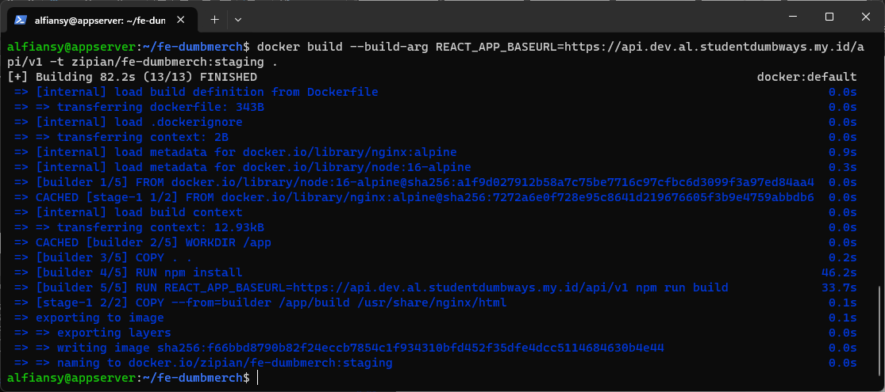

4. Push branch staging
```bash
git add .
git commit -m "docker img"
git push origin staging
```
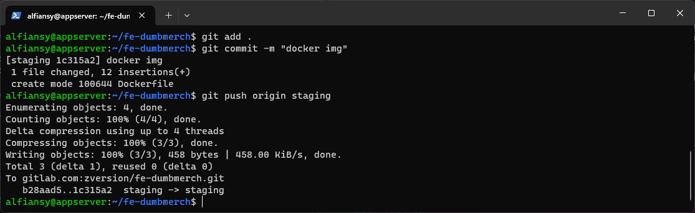

### 2.2. Production

1. Masuk ke branch production
```bash
git checkout production
```
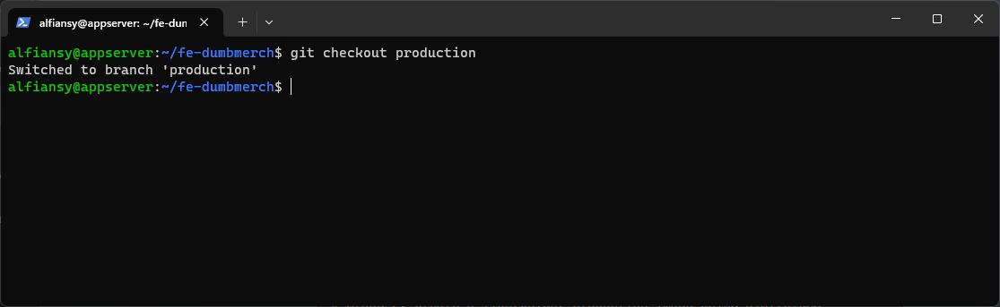

2. Membuat file `Dockerfile`
```bash
FROM node:16-alpine AS builder
WORKDIR /app
COPY . .
RUN npm install
ARG REACT_APP_BASEURL
ENV REACT_APP_BASEURL=$REACT_APP_BASEURL
RUN REACT_APP_BASEURL=$REACT_APP_BASEURL npm run build

FROM node:16-alpine AS final
WORKDIR /app
COPY --from=builder /app/build ./build
RUN npm install -g serve
EXPOSE 3000
CMD ["serve", "-s", "build", "-l", "3000"]
```

3. Buat image docker dengan nama `zipian/fe-dumbmerch:production` dan masukan juga variable dari env nya `https://api.al.studentdumbways.my.id/api/v1`
```bash
docker build --build-arg REACT_APP_BASEURL=https://api.al.studentdumbways.my.id/api/v1 -t zipian/fe-dumbmerch:production .
```
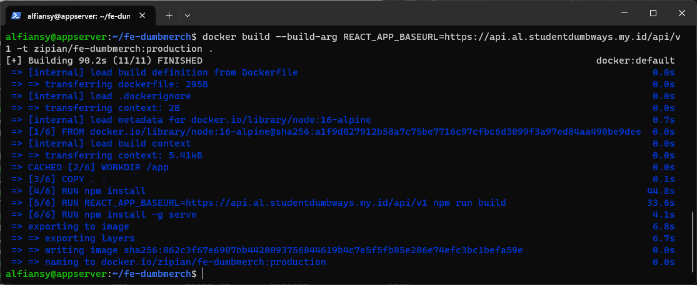

4. Push branch production
```bash
git add .
git commit -m "docker img"
git push origin production
```
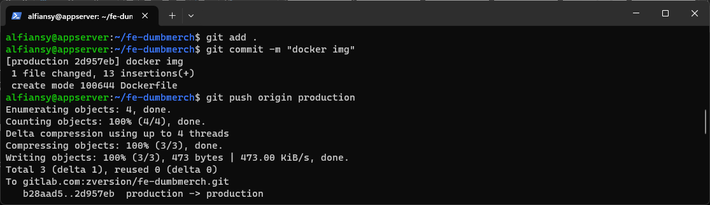

## 3. Create a Docker image for backend
### 3.1. Staging

1. Masuk ke direktori be dan branch staging
```bash
cd ~/be-dumbmerch/
git checkout staging
```
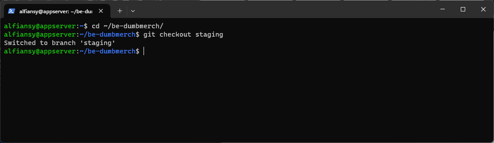

2. Modifikasi file `.env`
```bash
SECRET_KEY=Jayamas
PATH_FILE=http://localhost:5000/uploads/
SERVER_KEY=SB-Mid-server-fJAy6udMPnJCIyFguce8Eot3
CLIENT_KEY=SB-Mid-client-YUogx3u74Gq9MTMS
EMAIL_SYSTEM=alfiansy@yandex.com
PASSWORD_SYSTEM=Jayamas123
DB_HOST=containers-us-west-47.railway.app
DB_USER=postgres
DB_PASSWORD=
DB_NAME=railway
DB_PORT=7086
PORT=5000
```

3. Membuat file `Dockerfile`
```bash
FROM golang:1.16-alpine AS builder
WORKDIR /app
COPY . .
RUN go build -o myapp

FROM alpine:latest
WORKDIR /app
COPY --from=builder /app/.env /app/myapp ./
EXPOSE 5000
CMD ["./myapp"]
```

4. Buat image docker dengan nama `zipian/be-dumbmerch:staging`
```bash
docker build -t zipian/be-dumbmerch:staging .
```
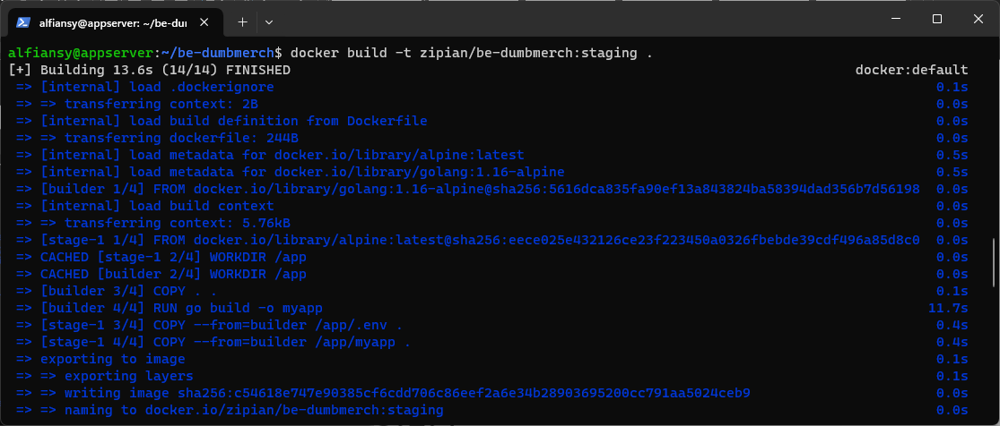

5. Push branch staging
```bash
git add .
git commit -m "docker img"
git push origin staging
```
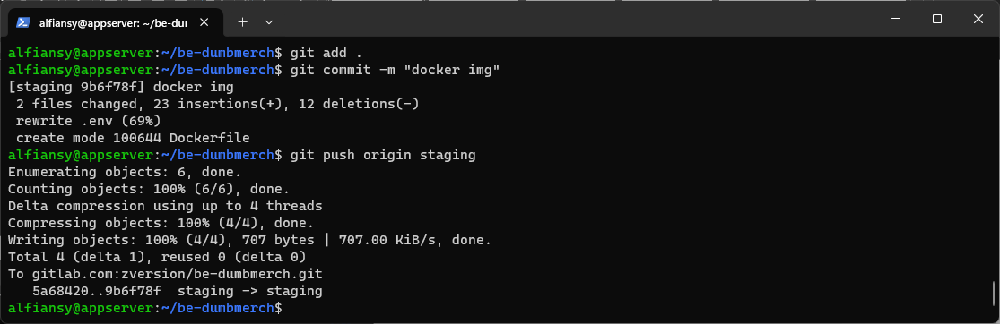

### 3.2. Production

1. Masuk ke branch production
```bash
git checkout production
```
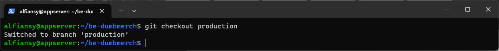

2. Lakukan merge branch
```bash
git merge staging
git commit -m "Merge branch 'staging' into 'production'"
git push origin production
```
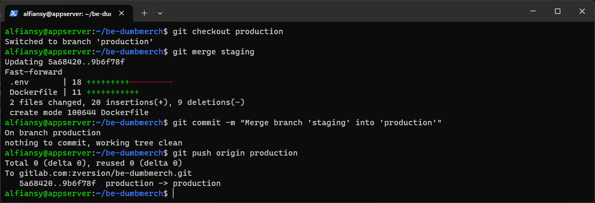

3. Membuat file `Dockerfile`
```bash
FROM golang:1.16-alpine AS builder
WORKDIR /app
COPY . .
RUN CGO_ENABLED=0 go build -o myapp

FROM gcr.io/distroless/base-debian10
WORKDIR /app
COPY --from=builder /app/.env /app/myapp .
EXPOSE 5000
CMD ["./myapp"]
```

4. Buat image docker dengan nama `zipian/be-dumbmerch:production`
```bash
docker build -t zipian/be-dumbmerch:production .
```
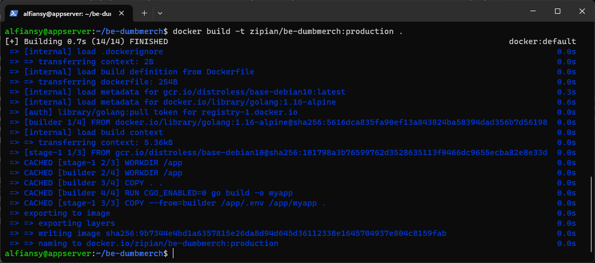

## 4. Create Docker compose file
### 4.1. Staging

1. Mebuat direktori `staging` file `docker-compose.yml`
```bash
version: "3.8"
services:
  frontend:
    image: zipian/fe-dumbmerch:staging
    container_name: fe-dm-stg
    stdin_open: true
    restart: always
    ports:
      - 3005:80

  backend:
    image: zipian/be-dumbmerch:staging
    container_name: be-dm-stg
    stdin_open: true
    restart: always
    ports:
      - 5005:5000
```

2. Menjalankan docker compose
```bash
docker compose up -d
```
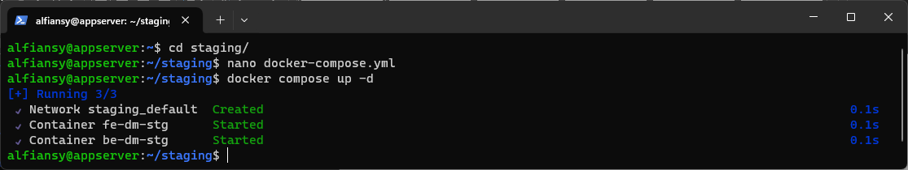

### 4.2. Production

1. Mebuat direktori `production` file `docker-compose.yml`
```bash
version: "3.8"
services:
  frontend:
    image: zipian/fe-dumbmerch:production
    container_name: fe-dm-prod
    stdin_open: true
    restart: always
    ports:
      - 3000:3000

  backend:
    image: zipian/be-dumbmerch:production
    container_name: be-dm-prod
    stdin_open: true
    restart: always
    ports:
      - 5000:5000
```

2. Menjalankan docker compose
```bash
docker compose up -d
```
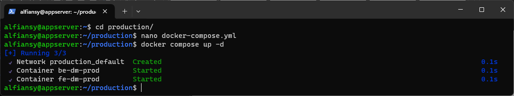

## 5. Docker image push

1. Login docker hub
```bash
docker login
``` 

2. Push semua image yang kita build tadi
```bash
docker push zipian/fe-dumbmerch:staging
docker push zipian/fe-dumbmerch:production
docker push zipian/be-dumbmerch:staging
docker push zipian/be-dumbmerch:production
```
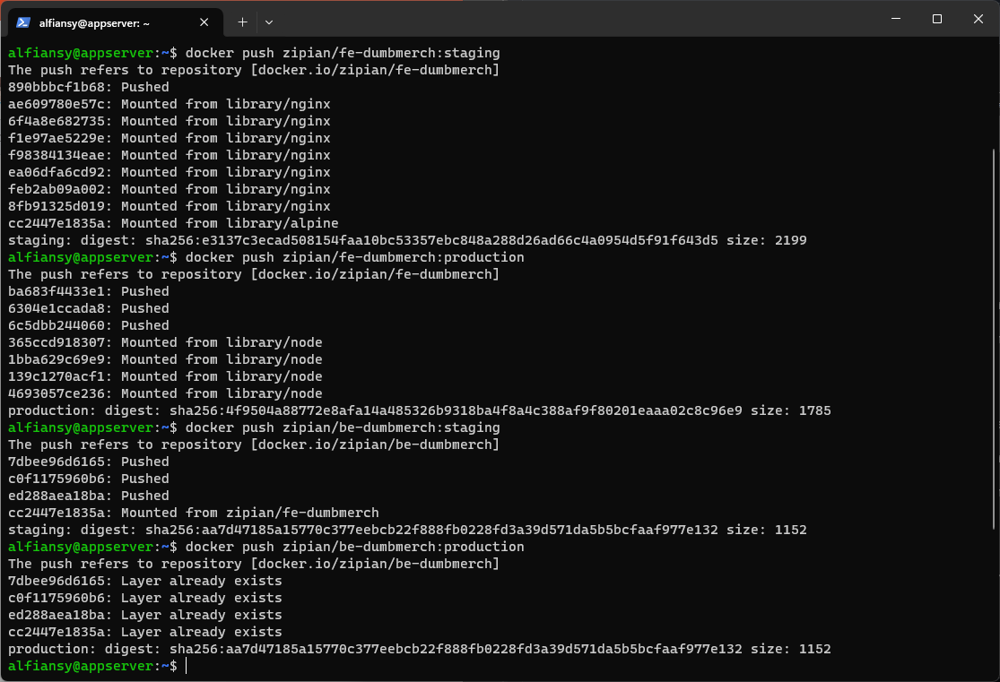

## 6. Create GitlabCI
### 6.1. Frontend
1. Buat variable pada repositori yang ingin di gunakan `Settings -> CI/CD -> Variables`
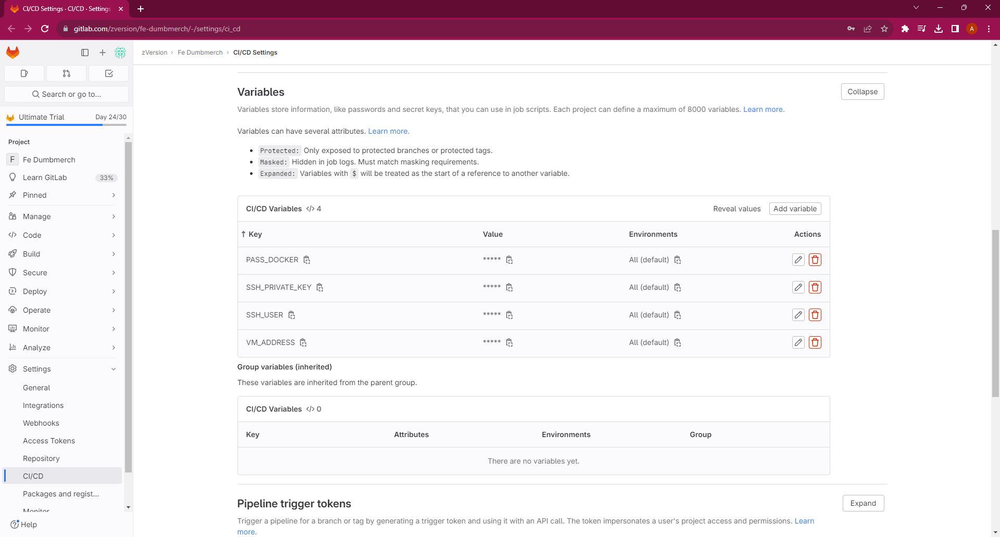

2. Membuat file `.gitlab-ci.yml` pada Pipeline Editor di branch staging dan production
`Staging`
```yaml
stages:
  - build
  - deploy

variables:
  DOCKER_NAME: "zipian"
  DOCKER_IMAGE: "fe-dumbmerch"

image-build:
  stage: build
  image: docker:1.11
  services:
    - docker:dind
  script:
    - export DOCKER_HOST=tcp://docker:2375/
    - apk add --update git
    # Repo pull
    - git pull origin $CI_COMMIT_REF_NAME
    # Image build
    - docker build --build-arg REACT_APP_BASEURL=https://api-dev.al.studentdumbways.my.id/api/v1 -t $DOCKER_NAME/$DOCKER_IMAGE:$CI_COMMIT_REF_NAME .
    # Image push
    - docker login -u zipian -p $PASS_DOCKER
    - docker push $DOCKER_NAME/$DOCKER_IMAGE:$CI_COMMIT_REF_NAME

deploy-app:
  stage: deploy
  before_script:
    - 'command -v ssh-agent >/dev/null || ( apk add --update openssh )' 
    - eval $(ssh-agent -s)
    - echo "$SSH_PRIVATE_KEY" | tr -d '\r' | ssh-add -
    - mkdir -p ~/.ssh
    - chmod 700 ~/.ssh
    - ssh-keyscan $VM_ADDRESS >> ~/.ssh/known_hosts
    - chmod 644 ~/.ssh/known_hosts
  script:
    # Running image container
    - ssh $SSH_USER@$VM_ADDRESS "docker pull $DOCKER_NAME/$DOCKER_IMAGE:$CI_COMMIT_REF_NAME"
    - ssh $SSH_USER@$VM_ADDRESS "cd ~/$CI_COMMIT_REF_NAME/ && docker compose up -d"
```
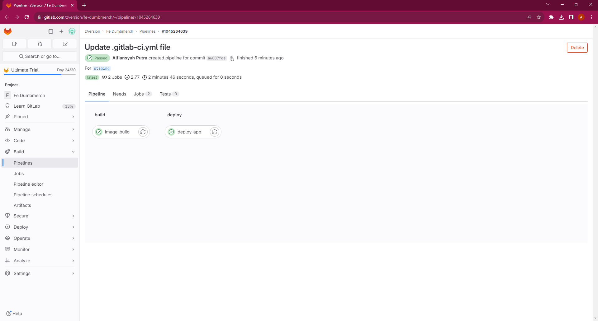

`Production`
```yaml
stages:
  - build
  - deploy

variables:
  DOCKER_NAME: "zipian"
  DOCKER_IMAGE: "fe-dumbmerch"

image-build:
  stage: build
  image: docker:1.11
  services:
    - docker:dind
  script:
    - export DOCKER_HOST=tcp://docker:2375/
    - apk add --update git
    # Repo pull
    - git pull origin $CI_COMMIT_REF_NAME
    # Image build
    - docker build --build-arg REACT_APP_BASEURL=https://api.al.studentdumbways.my.id/api/v1 -t $DOCKER_NAME/$DOCKER_IMAGE:$CI_COMMIT_REF_NAME .
    # Image push
    - docker login -u zipian -p $PASS_DOCKER
    - docker push $DOCKER_NAME/$DOCKER_IMAGE:$CI_COMMIT_REF_NAME

deploy-app:
  stage: deploy
  before_script:
    - 'command -v ssh-agent >/dev/null || ( apk add --update openssh )' 
    - eval $(ssh-agent -s)
    - echo "$SSH_PRIVATE_KEY" | tr -d '\r' | ssh-add -
    - mkdir -p ~/.ssh
    - chmod 700 ~/.ssh
    - ssh-keyscan $VM_ADDRESS >> ~/.ssh/known_hosts
    - chmod 644 ~/.ssh/known_hosts
  script:
    # Running image container
    - ssh $SSH_USER@$VM_ADDRESS "docker pull $DOCKER_NAME/$DOCKER_IMAGE:$CI_COMMIT_REF_NAME"
    - ssh $SSH_USER@$VM_ADDRESS "cd ~/$CI_COMMIT_REF_NAME/ && docker compose up -d"
```


### 6.2. Backend

1. Buat variable pada repositori yang ingin di gunakan `Settings -> CI/CD -> Variables`
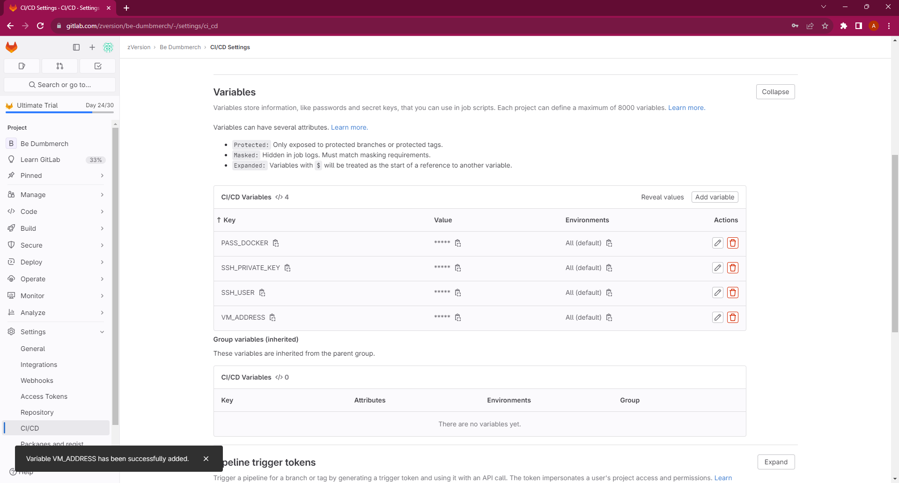

2. Membuat file `.gitlab-ci.yml` pada Pipeline Editor di branch staging dan production
`Staging` & `Production`
```yaml
stages:
  - build
  - deploy

variables:
  DOCKER_NAME: "zipian"
  DOCKER_IMAGE: "be-dumbmerch"

image-build:
  stage: build
  image: docker:1.11
  services:
    - docker:dind
  script:
    - export DOCKER_HOST=tcp://docker:2375/
    - apk add --update git
    # Repo pull
    - git pull origin $CI_COMMIT_REF_NAME
    # Image build
    - docker build -t $DOCKER_NAME/$DOCKER_IMAGE:$CI_COMMIT_REF_NAME .
    # Image push
    - docker login -u zipian -p $PASS_DOCKER
    - docker push $DOCKER_NAME/$DOCKER_IMAGE:$CI_COMMIT_REF_NAME

deploy-app:
  stage: deploy
  before_script:
    - 'command -v ssh-agent >/dev/null || ( apk add --update openssh )' 
    - eval $(ssh-agent -s)
    - echo "$SSH_PRIVATE_KEY" | tr -d '\r' | ssh-add -
    - mkdir -p ~/.ssh
    - chmod 700 ~/.ssh
    - ssh-keyscan $VM_ADDRESS >> ~/.ssh/known_hosts
    - chmod 644 ~/.ssh/known_hosts
  script:
    # Running image container
    - ssh $SSH_USER@$VM_ADDRESS "docker pull $DOCKER_NAME/$DOCKER_IMAGE:$CI_COMMIT_REF_NAME"
    - ssh $SSH_USER@$VM_ADDRESS "cd ~/$CI_COMMIT_REF_NAME/ && docker compose up -d"
```


[**Back**](../README.md)