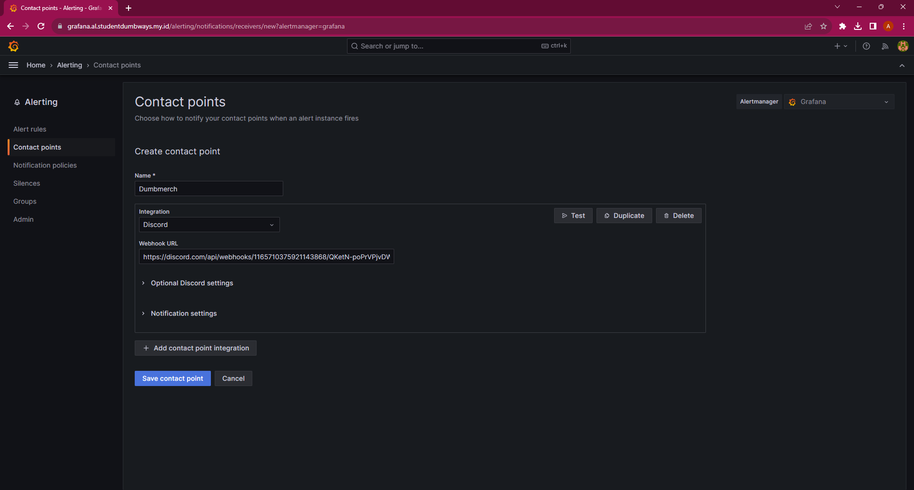

# 5. Monitoring

## 1. Setup Grafana dashboard

1. Login ke grafana `https://grafana.al.studentdumbways.my.id`

2. Add data source
- Type: Prometheus
- server URL: https://prometheus.al.studentdumbways.my.id
- Scrape interval: 10s
- Query timeout: 60s
- Default editor: Code


3. Lakukan import dashboard


4. Hasil dari import dashboard


## 2. Grafana Alert

1. Masuk ke tab `Alerting Home -> Alerting -> Contact points` untuk membuat Contact point


2. Ganti notification policy ke discord (Dumbmerch-DC)


3. Buat Alert Rules

`CPU Usage over 20%`
```bash
100 - (avg by(instance) (irate(node_cpu_seconds_total{mode="idle", job="dumbmerch"}[5m])) * 100)
```
- Threshold: 20
- Folder: Alert
- Evaluation group: Server
- Pending period: 5m
- Alert state if no data or all values are null: alerting

`RAM Usage over 50%`
```bash
100 * (1 - ((avg_over_time(node_memory_MemFree_bytes[10m]) + avg_over_time(node_memory_Cached_bytes[10m]) + avg_over_time(node_memory_Buffers_bytes[10m])) / avg_over_time(node_memory_MemTotal_bytes[10m])))
```
- Threshold: 50
- Folder: Alert
- Evaluation group: Server
- Pending period: 5m
- Alert state if no data or all values are null: alerting

`Free Storage 20%`
```bash
((node_filesystem_avail_bytes{job="dumbmerch",device!~'rootfs'} * 100) / node_filesystem_size_bytes{job="dumbmerch", mountpoint="/etc/hostname",device!~'rootfs'})
```
- Threshold: is below 20
- Folder: Alert
- Evaluation group: Server
- Pending period: 5m
- Alert state if no data or all values are null: alerting

`Network I/O over 30 p/s`
```bash
irate(node_network_receive_packets_total{job="dumbmerch",device="eth0"}[$__rate_interval])
```
- Threshold: 30
- Folder: Alert
- Evaluation group: Server
- Pending period: 5m
- Alert state if no data or all values are null: alerting


[**Back**](../README.md)