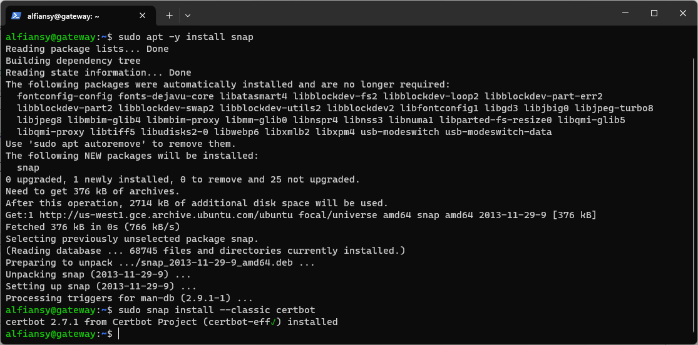
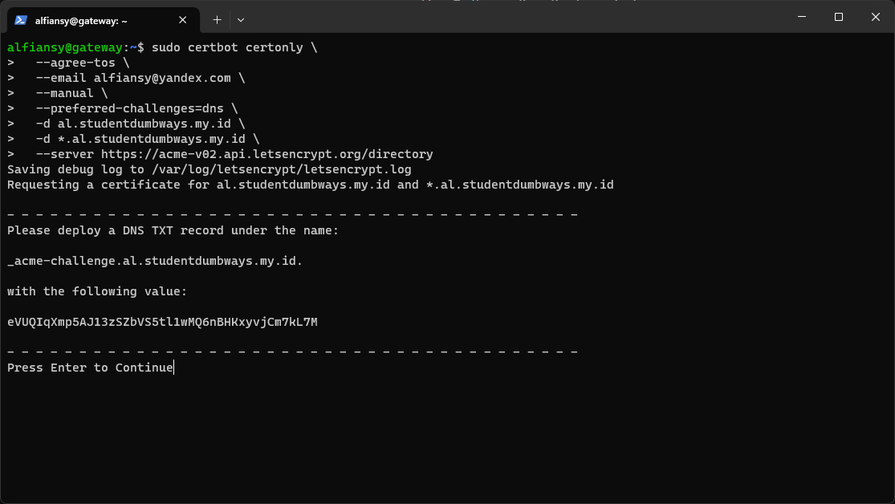
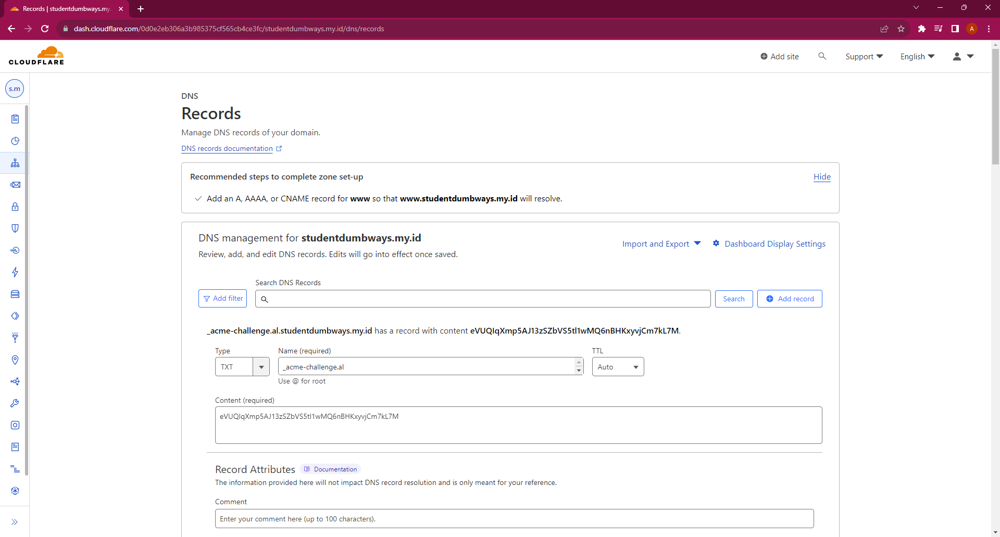
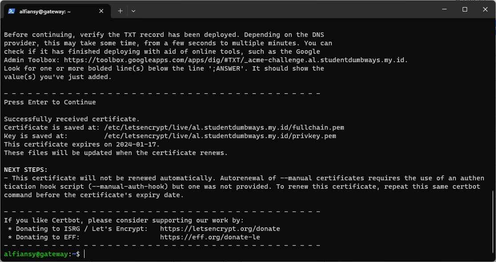
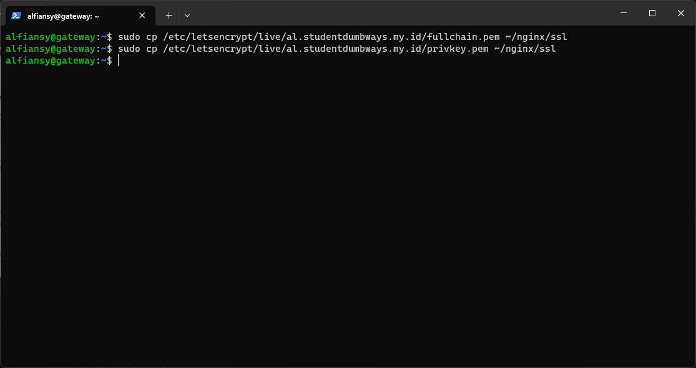
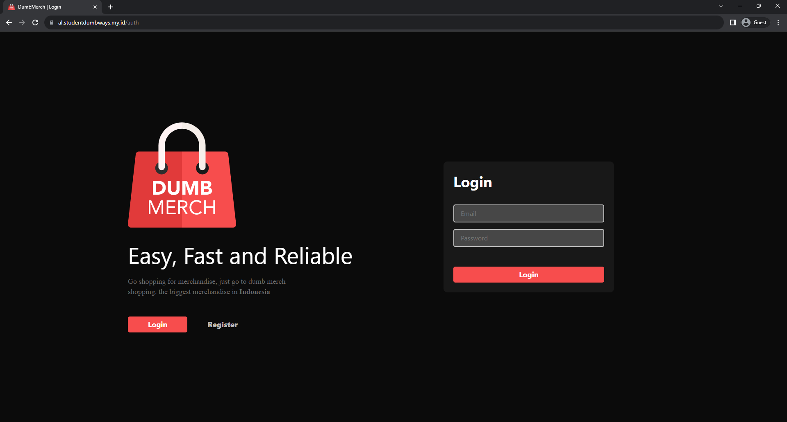

# 6. Web Server

## 1. Install a Wildcard SSL Certificate

1. Install packages certbot untuk kebutuhan SSL
```bash
sudo apt -y install snap
sudo snap install --classic certbot
```


2. Buatkan SSL wildcard
```bash
sudo certbot certonly \
  --agree-tos \
  --email alfiansy@yandex.com \
  --manual \
  --preferred-challenges=dns \
  -d al.studentdumbways.my.id \
  -d *.al.studentdumbways.my.id \
  --server https://acme-v02.api.letsencrypt.org/directory
```


3. Lalu tambahkan DNS sesuai dengan TXT yang sudah di intruksikan


4. Berikut jika sudah berhasil


5. Copy file ssl nya ke home direktori
```bash
sudo cp /etc/letsencrypt/live/al.studentdumbways.my.id/fullchain.pem ~/nginx/ssl
sudo cp /etc/letsencrypt/live/al.studentdumbways.my.id/privkey.pem ~/nginx/ssl
```


6. Lakukan pengecekan menggunakan browser
```bash
https://al.studentdumbways.my.id
```


## 2. Automatic renewal for Certificates

1. Buat script bash `renewal.sh`
```bash
#!/bin/bash

CERTBOT_OPTIONS="--agree-tos \
                 --email alfiansy@yandex.com \
                 --manual \
                 --preferred-challenges=dns \
                 -d al.studentdumbways.my.id \
                 -d *.al.studentdumbways.my.id \
                 --server https://acme-v02.api.letsencrypt.org/directory"

echo "2" | sudo certbot certonly $CERTBOT_OPTIONS

sleep 10
sudo cp /etc/letsencrypt/live/al.studentdumbways.my.id/fullchain.pem ~/nginx/ssl
sudo cp /etc/letsencrypt/live/al.studentdumbways.my.id/privkey.pem ~/nginx/ssl

sleep 3
docker restart nginx
```

2. Tambahkan izin untuk mengeksekusi
```bash
chmod +x renewal.sh
```

3. Jadwalkan eksekusi tiap 14 hari dengan crontab
```bash
sudo crontab -e
```

4. Tambahkan crontab expression
```bash
0 0 */14 * *  /home/alfiansy/renewal.sh
```

[**Back**](../README.md)