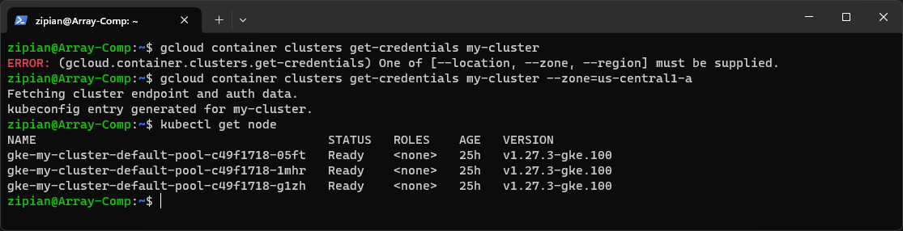
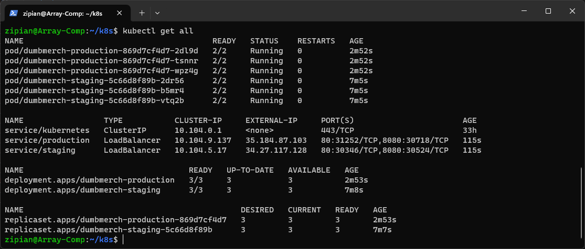
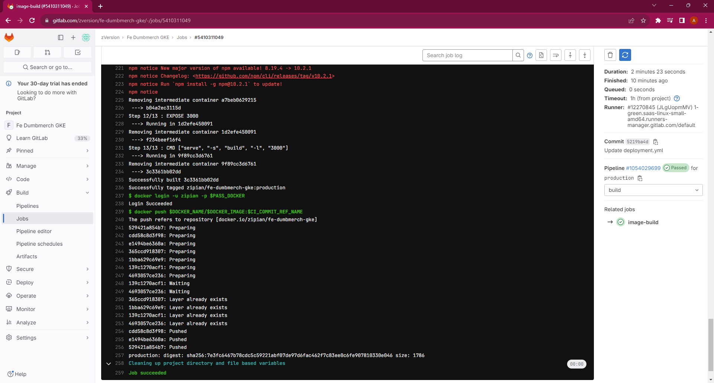
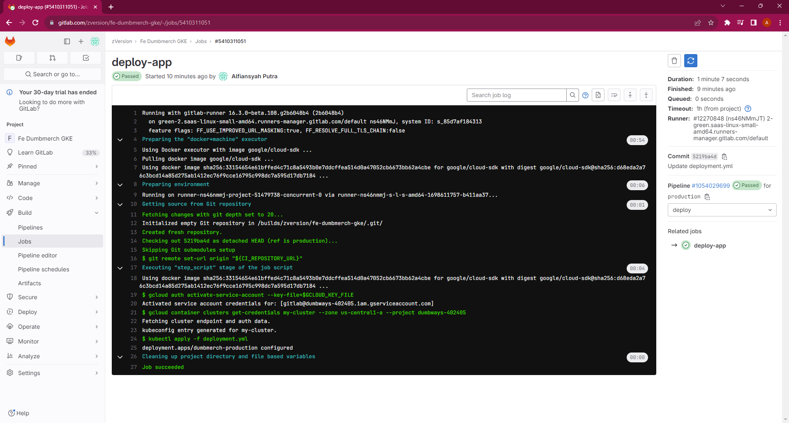
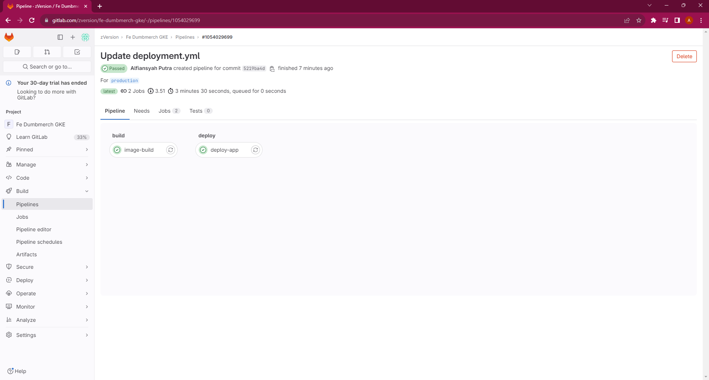

# 7. Microservices

## 1. Create Google Kubernetes Engine(GKE) Cluster using CLI

1. Mengatur project dan membuat cluster
```bash
gcloud config set project dumbways-402405
gcloud container clusters create my-cluster --num-nodes=3 --zone=us-central1-a
```

2. Membuat koneksi ke cluster
```bash
gcloud container clusters get-credentials my-cluster --zone=us-central1-a
```

3. Lalu cek apakah cluster sudah terkoneksi ke wsl atau belum dengan melakukan verisikasi nodes/worker
```bash
kubectl get node
```


4. Membuat file deployment `dumbmerch-staging.yml` dan `dumbmerch-production.yml`

`dumbmerch-staging.yml`
```yaml
apiVersion: apps/v1
kind: Deployment
metadata:
  name: dumbmerch-staging
  labels:
    env: staging
spec:
  replicas: 3
  selector:
    matchLabels:
      env: staging
  template:
    metadata:
      labels:
        env: staging
    spec:
      containers:
      - name: frontend
        image: zipian/fe-dumbmerch:staging
        ports:
        - containerPort: 80
      - name: backend
        image: zipian/be-dumbmerch:staging
        ports:
        - containerPort: 5000
```

`dumbmerch-production.yml`
```yaml
apiVersion: apps/v1
kind: Deployment
metadata:
  name: dumbmerch-production
  labels:
    env: production
spec:
  replicas: 3
  selector:
    matchLabels:
      env: production
  template:
    metadata:
      labels:
        env: production
    spec:
      containers:
      - name: frontend
        image: zipian/fe-dumbmerch-gke:production
        ports:
        - containerPort: 3000
      - name: backend
        image: zipian/be-dumbmerch-gke:production
        ports:
        - containerPort: 5000
```

5. Kemudian running deployment yang sudah dibuat
```bash
kubectl apply -f dumbmerch-staging.yml -f dumbmerch-production.yml
```

6. Buatkan service load balancer agar pod dapat di akses dari publik

`staging-lb.yml`
```yaml
apiVersion: v1
kind: Service
metadata:
  name: staging
spec:
  type: LoadBalancer
  selector:
    env: staging
  ports:
    - name: frontend
      port: 80
      targetPort: 80
    - name: backend
      port: 8080
      targetPort: 5000
```

`production-lb.yml`
```yaml
apiVersion: v1
kind: Service
metadata:
  name: production
spec:
  type: LoadBalancer
  selector:
    env: production
  ports:
    - name: frontend
      port: 80
      targetPort: 3000
    - name: backend
      port: 8080
      targetPort: 5000
```

7. Kemudian jalankan load balancer yang sudah dibuat
```bash
kubectl apply -f production-lb.yml -f staging-lb.yml
```

8. Cek hasil yang sudah dibuat
```bash
kubectl get all
```


## 2. GitLab CI/CD on Google Kubernetes Engine

1. Buat `Key` dari AIM -> Service Accounts kemudian download

2. Menambahkan `Key` yang di download tadi ke variable Gitlab CI/CD
- Key: GCLOUD_KEY_FILE
- Type: File
- Value: (isikan file dari step 1)

3. Membuat file `deployment.yml` pada branch production
```yaml
apiVersion: apps/v1
kind: Deployment
metadata:
  name: dumbmerch-production
  labels:
    env: production
spec:
  replicas: 3
  selector:
    matchLabels:
      env: production
  template:
    metadata:
      labels:
        env: production
    spec:
      containers:
      - name: frontend
        image: zipian/fe-dumbmerch-gke:production
        ports:
        - containerPort: 3000
      - name: backend
        image: zipian/be-dumbmerch-gke:production
        ports:
        - containerPort: 5000
```

4. Masuk ke *Pipeline Editor* masukan script berikut
```yaml
stages:
  - build
  - deploy

variables:
  DOCKER_NAME: "zipian"
  DOCKER_IMAGE: "fe-dumbmerch-gke"
  URL_API: "http://35.184.87.103:8080/api/v1"

image-build:
  stage: build
  image: docker:1.11
  services:
    - docker:dind
  script:
    - export DOCKER_HOST=tcp://docker:2375/
    - apk add --update git
    # Repo pull
    - git pull origin $CI_COMMIT_REF_NAME
    # Image build
    - docker build --build-arg REACT_APP_BASEURL=$URL_API -t $DOCKER_NAME/$DOCKER_IMAGE:$CI_COMMIT_REF_NAME .
    # Image push
    - docker login -u zipian -p $PASS_DOCKER
    - docker push $DOCKER_NAME/$DOCKER_IMAGE:$CI_COMMIT_REF_NAME

deploy-app:
  image: google/cloud-sdk
  stage: deploy
  before_script:
    - gcloud auth activate-service-account --key-file=$GCLOUD_KEY_FILE
    - gcloud container clusters get-credentials my-cluster --zone us-central1-a --project dumbways-402405
  script:
    - kubectl apply -f deployment.yml
```

5. Berikut hasilnya




[**Back**](../README.md)